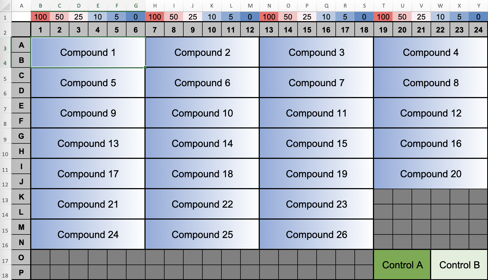
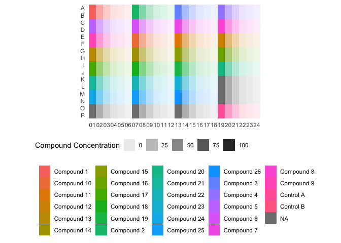

<!-- README.md is generated from README.Rmd. Please edit that file -->

# summerr </a>

<!-- badges: start -->
<!-- badges: end -->

The goal of `summerr` is to centralize the frequently used and some of
the more exotic R functions and routines encountered during import,
export, and processing of primary research data in the lab.

Many of these functions are re-used (imported) by more dedicated
packages of the `summerr` family.

## Installation

Since this package is not part of [CRAN](https://CRAN.R-project.org),
you must install and update the development version from
[GitHub](https://github.com/) with:

``` r
# install.packages("devtools")
devtools::install_github("benjbuch/summerr")
```

## Showcases

Some examples of general utility.

``` r
library(summerr)
```

### Importing Data

Interactive access to files and folders through RStudio API (if
available; else console-based chooser).

``` r
# select, e.g., an Excel file, ...
my_file <- select_single_file(suffix = "xlsx")

# ... or choose an entire directory to take forward
my_dir <- select_directory()
```

For example, a facility to import a 384-well plate layout created in
Excel with metadata columns/rows:



``` r
my_layout <- import_layout_from_excel(file = my_file, meta_row = c(concentration = "1"))

my_layout
#> # A tibble: 384 x 5
#>    well  well_let well_num content    concentration
#>    <chr> <chr>    <chr>    <chr>      <chr>        
#>  1 A01   A        01       Compound 1 100          
#>  2 A02   A        02       Compound 1 50           
#>  3 A03   A        03       Compound 1 25           
#>  4 A04   A        04       Compound 1 10           
#>  5 A05   A        05       Compound 1 5            
#>  6 A06   A        06       Compound 1 0            
#>  7 A07   A        07       Compound 2 100          
#>  8 A08   A        08       Compound 2 50           
#>  9 A09   A        09       Compound 2 25           
#> 10 A10   A        10       Compound 2 10           
#> # … with 374 more rows

display_plate_layout(my_layout, fill = content, alpha = as.numeric(concentration)) + 
  ggplot2::labs(alpha = "Compound Concentration", fill = NULL)
```



### Fitting Models

Calling `broom::tidy`, `broom::glance` and `broom::augment` on model
fitted to each group of a grouped data frame and returning, fail-safe,
these aspects:

``` r
library(magrittr)

iris %>% 
  dplyr::group_by(Species) %>% 
  model_cleanly_groupwise(lm, Sepal.Length ~ Sepal.Width)
#> # A tibble: 3 x 7
#> # Groups:   Species [3]
#>   Species    data              model  tidy             glance           
#>   <fct>      <list>            <list> <list>           <list>           
#> 1 setosa     <tibble [50 × 4]> <lm>   <tibble [4 × 5]> <tibble [1 × 12]>
#> 2 versicolor <tibble [50 × 4]> <lm>   <tibble [4 × 5]> <tibble [1 × 12]>
#> 3 virginica  <tibble [50 × 4]> <lm>   <tibble [4 × 5]> <tibble [1 × 12]>
#>   augment_old        augment_new     
#>   <list>             <list>          
#> 1 <tibble [50 × 10]> <tibble [0 × 0]>
#> 2 <tibble [50 × 10]> <tibble [0 × 0]>
#> 3 <tibble [50 × 10]> <tibble [0 × 0]>
```
